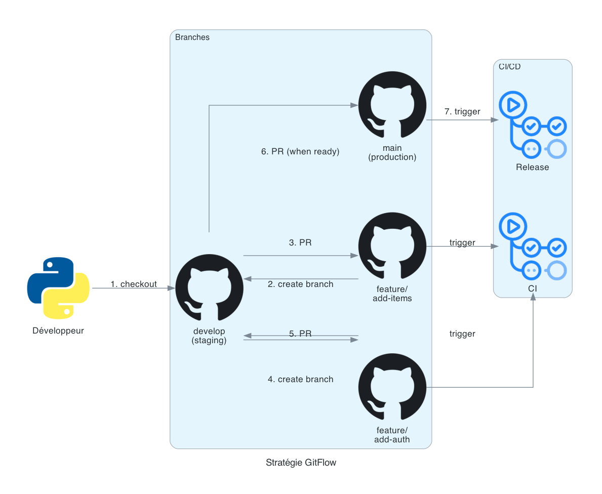

# CI/CD Pipeline for Production FastAPI Services

[](https://github.com/wbensolt/ci-cd-semantic-release/actions/workflows/ci-release.yml)
[](https://www.python.org/)
[](https://fastapi.tiangolo.com/)
[](https://python-semantic-release.readthedocs.io/)
[](LICENSE)

End-to-end CI/CD pipeline for a FastAPI + PostgreSQL service, with strict quality gates, automated semantic versioning, container vulnerability scanning, and GHCR publishing — production-ready standards in a self-contained reference repository.

## ✨ What this project demonstrates

- **4-stage pipeline** : pre-commit → lint / typecheck / security / tests → semantic-release → docker scan & push
- **Strict quality gates** : ruff (lint + format), mypy (`disallow_untyped_defs = true`), bandit (code security), safety (CVE on dependencies), pytest with `--cov-fail-under=60`
- **Automated versioning** via Python Semantic Release (Conventional Commits → SemVer bump → `CHANGELOG.md` → Git tag)
- **Container security** : Trivy scan in CI, fails the build on unfixed CRITICAL / HIGH vulnerabilities
- **GitHub App authentication** instead of a personal PAT for elevated CI permissions
- **Local–CI parity** : the same pre-commit hooks run locally and as the first CI job — no commit-time surprises

## 🏗️ Architecture

<p align="center">
  
</p>

### Pipeline phases

<p align="center">
  
</p>

### Git branching strategy

<p align="center">
  
</p>

## 🛠️ Stack

| Category | Tools |
|---|---|
| **Backend** | FastAPI 0.121 · SQLModel · Pydantic v2 |
| **Database** | PostgreSQL 16 (runtime) · SQLite in-memory (tests) |
| **Package manager** | uv (Astral) |
| **Code quality** | ruff · mypy strict · bandit · safety · pytest + coverage |
| **Pre-commit** | trailing-whitespace · end-of-file-fixer · check-yaml · detect-secrets · ruff · mypy |
| **CI/CD** | GitHub Actions · Python Semantic Release · Trivy |
| **Container** | Docker · GHCR (registry) |
| **CI auth** | GitHub App token (scoped, expirable) |

## 🚀 Quick start

### With Docker (recommended)

```bash
git clone https://github.com/wbensolt/ci-cd-semantic-release.git
cd ci-cd-semantic-release
docker compose up --build
```

API on `http://localhost:8000` — interactive docs at `/docs`.

### Without Docker

```bash
uv sync --all-groups
uv run fastapi dev app/main.py
```

### Run the test suite with coverage

```bash
uv run pytest --cov=app --cov-report=term tests/
```

## 🔄 CI/CD Pipeline

Triggered on every push to `main` / `develop` and every pull request. The workflow is defined in [`.github/workflows/ci-release.yml`](.github/workflows/ci-release.yml) and runs **4 jobs chained by dependency** :

### 1. `precommit` — Pre-commit hooks
Trailing whitespace, EOF fixes, YAML lint, large files block, private key detection, merge conflict markers, ruff lint + format, mypy strict, `detect-secrets` baseline diff. The exact same hooks run locally via `pre-commit install`.

### 2. `checks` — Lint / Typecheck / Security / Tests

| Step | Tool | Configuration |
|---|---|---|
| Lint | `ruff check .` + `ruff format --check .` | `pyproject.toml` |
| Typecheck | `mypy app/` | `disallow_untyped_defs = true` |
| Code security | `bandit -r app/` | Static security analysis |
| Dependency CVE | `safety check` | Known vulnerabilities database |
| Tests | `pytest --cov=app --cov-fail-under=60` | SQLite in-memory fixtures |

### 3. `release` — Semantic Versioning
Runs only on push (not on PR). Uses Python Semantic Release with a GitHub App token. Parses Conventional Commits → bumps version per SemVer → updates `CHANGELOG.md` → creates Git tag.

### 4. `docker` — Build, Scan & Push
Runs only on `main`. Builds the image → **Trivy** scans for vulnerabilities → fails on unfixed CRITICAL / HIGH → pushes to GHCR with version tag + `latest`.

## 📊 Quality targets

| Metric | Target | Enforced by |
|---|---|---|
| Test coverage (`app/`) | ≥ 60 % | `pytest --cov-fail-under=60` |
| Untyped function definitions | 0 | mypy `disallow_untyped_defs` |
| Lint issues | 0 | ruff |
| Security findings (CRITICAL/HIGH) | 0 | bandit + safety + Trivy |

## 🌳 Branching strategy

```
main      ─── production (Docker publish to GHCR)
develop   ─── integration (semantic-release tag)
feature/* ─── work branches → PR → develop
```

Conventional Commits (`feat:`, `fix:`, `docs:`, `chore:`, `refactor:`) drive automatic SemVer bumps.

## 📚 Project documentation

Analytical write-ups are in [`docs/`](docs/) :

- [`VEILLE_CICD.md`](docs/VEILLE_CICD.md) — Technical watch on CI/CD concepts
- [`COMPARATIF_OUTILS.md`](docs/COMPARATIF_OUTILS.md) — Tool selection analysis (linters, formatters, scanners)
- [`PROBLEMES_DETECTES.md`](docs/PROBLEMES_DETECTES.md) — Issues encountered and resolutions
- [`BRIEF_CI_CD_V2.md`](docs/BRIEF_CI_CD_V2.md) — Original 8-phase brief (educational reference)

## 📖 Context

This repository was initiated as part of an advanced training brief (Simplon × Microsoft AI School, 2025), then extended to apply production-grade standards : strict type checking, container vulnerability scanning, GitHub App authentication, and a 4-job CI/CD pipeline with automated semantic versioning.

## 📄 License

[MIT](LICENSE) © Wael Bensoltana
